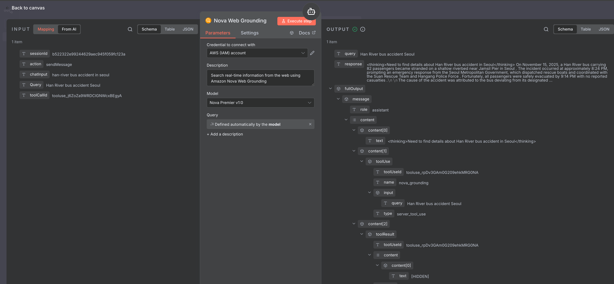
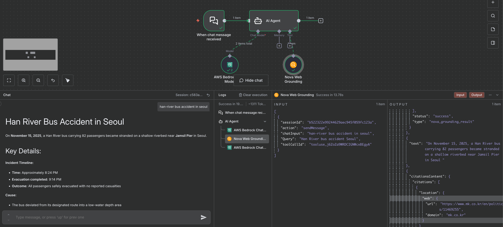

# n8n-nodes-nova-web-grounding

n8n community node for Amazon Nova Web Grounding - enables AI agents to search real-time information from the web.

## Installation

```bash
npm install n8n-nodes-nova-web-grounding
```

## Prerequisites

- AWS account with access to Amazon Bedrock
- Amazon Nova Premier model access in your AWS region
- AWS credentials (Access Key ID and Secret Access Key)

## Current Limitations

**As of November 18, 2025:**
- Only **us-east-1** region is supported for Nova Web Grounding
- Only **Nova Premier v1:0** model supports web grounding capabilities
- Other Nova models (Pro, Lite, Micro) do not support web grounding feature

## Configuration

The node requires the following parameters:

- **AWS Region**: AWS region where Nova model is available (default: us-east-1)
- **AWS Access Key ID**: Your AWS access key ID
- **AWS Secret Access Key**: Your AWS secret access key  
- **Query**: Search query for web grounding

## Usage

1. Add the "Nova Web Grounding" node to your n8n workflow
2. Configure your AWS credentials and region
3. Enter your search query
4. The node will return real-time web information using Amazon Nova's grounding capabilities

## Output

The node returns:
- `query`: The original search query
- `response`: The grounded response from Nova
- `usage`: Token usage information
- `error`: Error message if the request fails

## Local Development

### Setup
```bash
# Clone and install dependencies
npm install

# Build the node using n8n-node CLI
npm run build

# Watch for changes during development
npm run dev
```

### Testing with n8n

#### Prerequisites
- Node.js 18, 20, or 22 (n8n doesn't support Node.js 25+)
- Use Node.js 20 for best compatibility

```bash
# Install n8n globally
npm install -g n8n@latest

# Link the node for local testing
npm link

# In your n8n installation directory, link this package
cd ~/.n8n/nodes
npm link n8n-nodes-nova-web-grounding

# Start n8n
n8n start
```

## Tool Integration

This node is designed as an AI tool with the following properties:
- **Tool Name**: `nova_web_grounding`
- **Description**: Search real-time information from the web using Amazon Nova Web Grounding
- **Input Schema**: Requires a `query` string parameter

## License

MIT

## Contributing

Contributions are welcome! Please feel free to submit a Pull Request.

## Appendix

### Screenshots


*Example workflow using Nova Web Grounding for real-time web search*


*Query result with Nova Web Grounding - shows the latest information*


*Query result without Nova Web Grounding - shows outdated information*